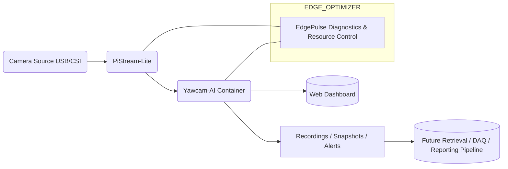

# Yawcam-AI Dockerized 
### Edge-Ready Deployment

---

This project delivers **containerized, persistent, and edge-oriented deployments** of
[Yawcam-AI](https://github.com/yawcam/yawcam-ai) — turning it from a desktop application into a
**service-grade inference and recording engine** suitable for edge devices like Raspberry Pi,
NUCs, and GPU-accelerated nodes.

>  Yawcam-AI authors: [https://github.com/yawcam/yawcam-ai](https://github.com/yawcam/yawcam-ai)
>  This repository focuses on **systems design, orchestration, benchmarking, and edge integration**.

---

#  Why This Exists

Running computer vision on constrained edge hardware is hard:

* RAM starvation
* CPU throttling
* unpredictable dependencies
* no clean lifecycle
* manual setup per device
* difficult sharing between teams

So instead of running Yawcam-AI “manually,” this repo:

✔ containerizes it,
✔ gives it persistent state,
✔ integrates it with edge telemetry,
✔ aligns it with RTSP capture nodes,
✔ prepares future offload to Jetson-class accelerators, and
✔ fits it inside a modular edge ecosystem.

The mindset behind this work:

> “Small, composable subsystems cooperating through clean interfaces
> produce resilient edge intelligence.”

---

#  Docker Hub Images

### CPU-only build (works everywhere — laptop, VM, Pi, NUC)

```
docker pull devprincekumar/yawcam-ai:latest
```

### CUDA build (for x86 + NVIDIA GPU hosts or remote GPU nodes)

```
docker pull devprincekumar/yawcam-ai:cuda
```

**Note:**
Raspberry Pi hardware has **no CUDA**, so inference is CPU-only on Pi.
GPU inference is available on:

* x86 workstations,
* servers with NVIDIA cards,
* Jetson class devices (future remote inference compute role).

The CUDA version falls back gracefully to CPU where GPU is absent.

---

# Repository Structure

```
yawcam-ai-dockerized/
│
├── docker/
│   ├── cpu/      # CPU-only build for Pi, NUC, cloud instances
│   ├── gpu/      # CUDA-enabled build for x86 + NVIDIA
│   └── alpine/   # experimental minimal footprint
│
├── compose/
│   ├── docker-compose.cpu.yml      # Raspberry Pi / generic CPU
│   ├── docker-compose.gpu.yml      # workstations / Jetson / GPU nodes
│   └── docker-compose.dual.yml     # benchmarking mode
│
├── docs/
│   ├── 01-project-summary.md
│   ├── 02-architecture.md
│   ├── 03-performance-comparison.md
│   ├── 04-model-swap-and-finetune.md
│   └── 05-edgepulse-integration.md
│
└── README.md
```
---

# Core Features (Edge-Friendly)

✔ Persistent configuration + models + database
✔ Persistent video recording vault
✔ LAN web UI
✔ RTSP-first workflow
✔ CPU inference on Pi & low-power SBCs
✔ GPU inference on CUDA nodes
✔ Hot-swappable YOLO variants
✔ Side-by-side CPU vs GPU benchmarking into future
✔ Local event automation:

* email alerts
* FTP uploads
* external script execution on detection

This means **action happens on device** — not cloud dependent.

---

# Full Edge Pipeline — How the System Works End-to-End

This repo is one subsystem of a **3-layer edge intelligence stack**:

### ░ Layer 1 — Capture / Input

**PiStream-Lite** publishes camera feeds as RTSP:  
[https://github.com/855princekumar/PiStream-Lite](https://github.com/855princekumar/PiStream-Lite)

### ░ Layer 2 — Inference + Storage

**Yawcam-AI container (this repo)**

* subscribes RTSP
* runs detection
* stores video
* manages UI
* executes event automations

### ░ Layer 3 — Stability + Observability

**EdgePulse** monitors SBC health + applies optimization cycles:
[https://github.com/855princekumar/edgepulse](https://github.com/855princekumar/edgepulse)

---

# Architecture Overview



##### This expresses clear separation of responsibility:

- PiStream-Lite handles
*Capture + Transport*

- Yawcam-AI handles
*Inference + Vault + Control Plane*

- EdgePulse ensures
*Stability + 24/7 Availability*

---

# How It Runs 24/7 on Pi-Class Devices

### CPU inference — no CUDA required

Yawcam-AI handles inference thread under CPU fallback.

### ZRAM enabled

EdgePulse provisions compressed memory to avoid OOM kills.

### Swap elasticity

EdgePulse can extend swap space to absorb spikes from:

* DB writes
* model loading
* stream bursts
* recording threads

### Thermal back-pressure awareness

EdgePulse detects:

* CPU hotspot escalation
* throttling triggers

and can reschedule workload or notify automation scripts.

### Yawcam-AI’s built-in automation layer

Acts on detections:

* sends email snapshots
* uploads clips to FTP/NAS
* executes scripts for alarm relays / automation

**All of this happens without cloud dependency**,
which is a foundational requirement for resilient edge compute.

---

# Future GPU Offload / Jetson Role

Jetson-class boards or remote NVIDIA hosts are envisioned as **distributed inference accelerators**:

* Pi does input capture + vaulting
* Jetson does compute
* Pi receives detection results

This extends architecture from:

➤ **Edge node with inference**
to
➤ **Edge mesh with GPU offload**

(enabling high-FPS detection while Pi remains stable)

This is future-aligned and under planned integration.

---

# Model Usage & Customization

Yawcam-AI supports **three YOLO variants** internally:

```
yolo-v7
yolo-v7-tiny
yolo-v4-tiny
```

You may:

✔ retrain
✔ fine-tune
✔ replace weights/config per variant

by overwriting the container’s model directories via mapped volumes. Arbitrary model families require upstream engine modification (YOLOv8/RT-DETR etc. not plug-and-play — for now).

See: `/docs/04-model-swap-and-finetune.md`

---

# Performance Summary

CPU inference works sufficiently for:

* Pi 4
* Pi 5
* NUCs
* Laptops
* Low-end servers

GPU inference accelerates throughput dramatically but is optional.

See benchmarks here: `/docs/03-performance-comparison.md`

---

# Deployment

## CPU Mode (Pi, SBC, VM, NUC)

```
docker pull devprincekumar/yawcam-ai:latest
docker compose -f compose/docker-compose.cpu.yml up -d
```

Open UI:
- [http://localhost:5995](http://localhost:5995)

---

## GPU Mode (Workstation / Jetson / Remote GPU Node)

```
docker pull devprincekumar/yawcam-ai:cuda
docker compose -f compose/docker-compose.gpu.yml up -d
```

UI:  [http://localhost:5996](http://localhost:5996)

---

## Parallel Testing

```
docker compose -f compose/docker-compose.dual.yml up -d
```

---

# Persistence & Access

Container state is mapped to host:

```
./data/.yawcam-ai
./data/recordings
```

These hold:

✔ models
✔ configuration
✔ database
✔ logs
✔ detected events
✔ video clips

Giving **durable edge state** for troubleshooting, analysis or forensic replay.

---

# Design Philosophy

This work applies classic system design principles:

> divide responsibility, 
> keep interfaces narrow,
> ensure failure isolation,
> persist state outside runtime,
> and optimize iteratively.

Rather than assuming “AI is the system,”
this project treats AI as **one cooperating subsystem**
inside a complete edge appliance.

---

# Roadmap

* Alpine-optimized builds
* Jetson remote compute handshake
* Metrics exporter
* EdgePulse service plug-ins
* Helm charts for K3s/edge Kubernetes
* NAS archival + pruning policy

---

# Credits

- Yawcam-AI author(s) → [https://github.com/yawcam/yawcam-ai](https://github.com/yawcam/yawcam-ai)
- PiStream-Lite → capture layer
- EdgePulse → stabilization layer

This repo simply **connects, optimizes and deploys** them as operational edge services.

---

# Summary

Yawcam-AI Dockerized yields:

* a persistent
* repeatable
* automatable
* edge-compatible
* inference appliance

running 24/7 even on Pi-class devices,
with an upgrade path toward Jetson offloading.

This is **practical edge AI engineering**, not hype.

---


