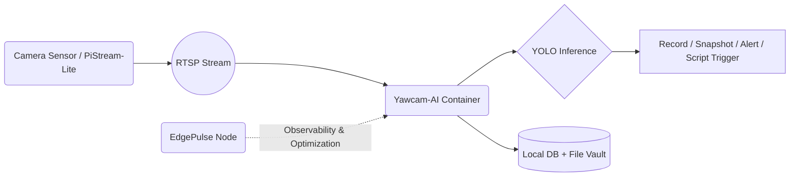

# Architecture 
## End-to-End Edge Video AI System

--- 

## High Level Pipeline



---

## Component Roles

### PiStream-Lite

* runs on Pi or SBC
* exposes H264/H265 RTSP feed
* optimized encoder pipeline

### Yawcam-AI container

* consumes RTSP
* runs YOLOv7 / YOLOv7-tiny / YOLOv4-tiny inference
* stores:

  * events
  * videos
  * thumbnails
  * configurations

### EdgePulse

* long-running monitor + optimizer agent
* prevents edge collapse & performance drift
* maintains usable headroom

---

## Deployment Flows

### CPU deployment

```
docker compose -f docker-compose.cpu.yml up -d
```

### GPU acceleration (host w/ CUDA)

```
docker compose -f docker-compose.gpu.yml up -d
```

### Side-by-side benchmarking mode

```
docker compose -f docker-compose.dual.yml up -d
```