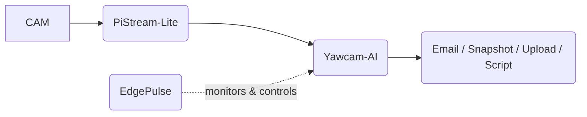

# EdgePulse Integration 
## Operational Reliability Layer

EdgePulse is designed to **monitor, diagnose, and intervene**
before edge workloads collapse.

This repo uses EdgePulse for:

✔ thermal awareness
✔ memory reclamation via zRAM + swap
✔ throttling alerts
✔ headroom monitoring
✔ sustained inference pacing

---

## How It Stitches Together

---

## Why EdgePulse Matters

Yawcam-AI can:

* generate email notifications
* upload via FTP
* execute external scripts

…but without system controls, long-lived inference nodes **will degrade**.

EdgePulse:

* compresses memory via zRAM strategy
* frees swap intelligently
* controls thermal saturation
* protects inference loop

➡ this transforms a hobby workload into operational infrastructure.

---

